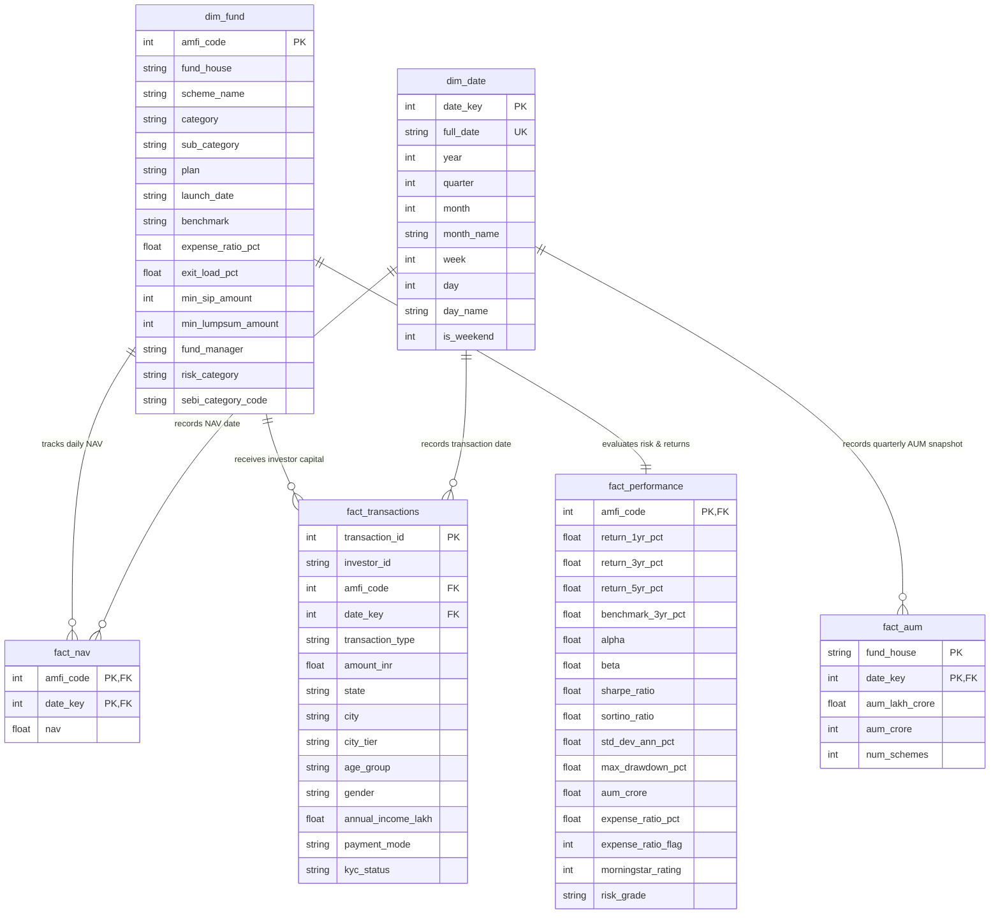

# Star Schema Database Design Documentation (Day 02)

**Project:** Bluestock Mutual Fund Capstone — Day 02 Data Cleaning & SQL  
**Generated On:** 2026-08-03  
**Database Engine:** SQLite 3  
**Target Schema Specification:** Star Schema Dimensional Model  

---

## Executive Overview

The database design for the **Bluestock Mutual Fund Capstone Project** adheres to dimensional modeling principles using a **Star Schema** architecture. 

In a traditional relational OLTP system, schemas are highly normalized (3NF) to eliminate redundancy for transaction processing. In analytical data warehousing (OLAP), a **Star Schema** organizes data into central **Fact Tables** (containing numeric measurements and business events) surrounded by **Dimension Tables** (containing contextual metadata and slice-and-dice attributes).

### Why a Star Schema?
1. **Simplified Analytical Queries**: Reduces complex multi-table `JOIN` operations into intuitive star joins connecting facts to shared dimensions.
2. **High-Performance Aggregation**: Slicing and filtering by dimensions (`dim_fund`, `dim_date`) before aggregating measures in fact tables provides high query efficiency.
3. **Business User Accessibility**: Business analysts and BI tools (PowerBI, Tableau) can easily navigate the schema without deep knowledge of complex database normalization.

---

## Architecture Diagram

### ASCII Visual Diagram

```
                             ┌───────────────────────────────┐
                             │           dim_date            │
                             ├───────────────────────────────┤
                             │ PK  date_key                  │
                             │     full_date                 │
                             │     year, quarter, month      │
                             │     month_name, week, day     │
                             │     day_name, is_weekend      │
                             └───────────────┬───────────────┘
                                             │
             ┌───────────────────────────────┼───────────────────────────────┐
             │                               │                               │
             ▼                               ▼                               ▼
┌───────────────────────────┐   ┌───────────────────────────┐   ┌───────────────────────────┐
│         fact_nav          │   │     fact_transactions     │   │         fact_aum          │
├───────────────────────────┤   ├───────────────────────────┤   ├───────────────────────────┤
│ PK,FK1  amfi_code         │   │ PK  transaction_id        │   │ PK,FK1  fund_house        │
│ PK,FK2  date_key          │   │ FK1 amfi_code             │   │ PK,FK2  date_key          │
│         nav               │   │ FK2 date_key              │   │         aum_lakh_crore    │
└────────────▲──────────────┘   │     investor_id           │   │         aum_crore         │
             │                  │     transaction_type      │   │         num_schemes       │
             │                  │     amount_inr            │   └───────────────────────────┘
             │                  │     state, city, city_tier│
             │                  │     age_group, gender     │
             │                  │     annual_income_lakh    │
             │                  │     payment_mode          │
             │                  │     kyc_status            │
             │                  └────────────┬──────────────┘
             │                               │
             └───────────────────────────────┼───────────────────────────────┐
                                             │                               │
                                             ▼                               ▼
                             ┌───────────────────────────────┐   ┌───────────────────────────┐
                             │           dim_fund            │   │     fact_performance      │
                             ├───────────────────────────────┤   ├───────────────────────────┤
                             │ PK  amfi_code                 │◀──│ PK,FK amfi_code           │
                             │     fund_house, scheme_name   │   │       return_1yr_pct      │
                             │     category, sub_category    │   │       return_3yr_pct      │
                             │     plan, launch_date         │   │       return_5yr_pct      │
                             │     benchmark, expense_ratio  │   │       benchmark_3yr_pct   │
                             │     exit_load, min_sip_amt    │   │       alpha, beta, sharpe │
                             │     min_lumpsum_amt           │   │       sortino, std_dev    │
                             │     fund_manager, risk_cat    │   │       max_drawdown_pct    │
                             │     sebi_category_code        │   │       aum_crore           │
                             └───────────────────────────────┘   │       expense_ratio_pct   │
                                                                 │       expense_ratio_flag  │
                                                                 │       morningstar_rating  │
                                                                 │       risk_grade          │
                                                                 └───────────────────────────┘
```

### Mermaid ER Diagram



---

## Dimension Tables Specification

### 1. `dim_fund`
- **Source:** `01_fund_master_cleaned.csv`
- **Primary Key:** `amfi_code` (`INTEGER PRIMARY KEY`)
- **Business Purpose:** Central dimension table containing all qualitative metadata, fund attributes, category classifications, and operational policies for every mutual fund scheme.
- **Key Columns:**
  - `amfi_code`: Unique 6-digit AMFI identifier.
  - `fund_house`: Asset Management Company (AMC) name.
  - `scheme_name`: Full scheme name.
  - `category` & `sub_category`: SEBI asset class definitions.
  - `benchmark`: Primary comparison index.

### 2. `dim_date`
- **Source:** Generated Calendar Dimension from min/max date range across all datasets (`2022-01-01` to `2026-05-31`).
- **Primary Key:** `date_key` (`INTEGER PRIMARY KEY`, e.g., `20240115`)
- **Business Purpose:** Shared conformed time dimension enabling uniform time-series aggregation (daily, monthly, quarterly, yearly, YoY, MoM).
- **Key Columns:** `full_date`, `year`, `quarter`, `month`, `month_name`, `week`, `day`, `day_name`, `is_weekend`.

---

## Fact Tables Specification

### 1. `fact_nav`
- **Source:** `02_nav_history_cleaned.csv`
- **Primary Key:** Composite Key `(amfi_code, date_key)`
- **Foreign Keys:**
  - `amfi_code` → `dim_fund(amfi_code)`
  - `date_key` → `dim_date(date_key)`
- **Business Purpose:** High-frequency transaction fact table recording daily Net Asset Values for performance calculation and valuation.
- **Numeric Measure:** `nav` (REAL).

### 2. `fact_transactions`
- **Source:** `08_investor_transactions_cleaned.csv`
- **Primary Key:** `transaction_id` (`INTEGER PRIMARY KEY AUTOINCREMENT`)
- **Foreign Keys:**
  - `amfi_code` → `dim_fund(amfi_code)`
  - `date_key` → `dim_date(date_key)`
- **Business Purpose:** Granular retail transaction event table recording SIP, Lumpsum, and Redemption flows, investor demographics, and payment channels.
- **Measures & Attributes:** `amount_inr`, `investor_id`, `transaction_type`, `state`, `city`, `city_tier`, `age_group`, `gender`, `annual_income_lakh`, `payment_mode`, `kyc_status`.

### 3. `fact_performance`
- **Source:** `07_scheme_performance_cleaned.csv`
- **Primary Key:** `amfi_code` (`INTEGER PRIMARY KEY`)
- **Foreign Key:** `amfi_code` → `dim_fund(amfi_code)`
- **Business Purpose:** Scheme performance and risk rating fact table storing annualized returns, market risk indicators (Alpha, Beta, Sharpe, Sortino), and expense ratio audit flags.
- **Measures:** `return_1yr_pct`, `return_3yr_pct`, `return_5yr_pct`, `benchmark_3yr_pct`, `alpha`, `beta`, `sharpe_ratio`, `sortino_ratio`, `std_dev_ann_pct`, `max_drawdown_pct`, `aum_crore`, `expense_ratio_pct`, `expense_ratio_flag`, `morningstar_rating`, `risk_grade`.

### 4. `fact_aum`
- **Source:** `03_aum_by_fund_house_cleaned.csv`
- **Primary Key:** Composite Key `(fund_house, date_key)`
- **Foreign Key:** `date_key` → `dim_date(date_key)`
- **Business Purpose:** Macro-level quarterly fund house asset table capturing total AUM and active scheme counts per AMC over time.
- **Measures:** `aum_lakh_crore`, `aum_crore`, `num_schemes`.

---

## Indexing Strategy for High-Performance Analytics

To optimize query execution for large analytical queries, joins, and time-range filtering in SQLite, the following indexes are defined in `sql/schema.sql`:

```sql
-- Fact NAV indexes
CREATE INDEX idx_nav_date ON fact_nav(date_key);
CREATE INDEX idx_nav_fund ON fact_nav(amfi_code);

-- Fact Transactions indexes
CREATE INDEX idx_txn_date ON fact_transactions(date_key);
CREATE INDEX idx_txn_fund ON fact_transactions(amfi_code);

-- Fact AUM indexes
CREATE INDEX idx_aum_date ON fact_aum(date_key);
CREATE INDEX idx_aum_fund_house ON fact_aum(fund_house);
```

### Performance Benefits:
- **`idx_nav_date` & `idx_txn_date`**: Accelerate time-based range queries (e.g., querying NAV or transactions for Q1 2024).
- **`idx_nav_fund` & `idx_txn_fund`**: Speed up joins between `dim_fund` and high-volume fact tables (`fact_nav` has 46,000 rows, `fact_transactions` has 32,778 rows).
- **`idx_aum_date` & `idx_aum_fund_house`**: Optimize AMC market share analysis and quarterly AUM aggregations.

---

## Verification & Status
- **Schema File:** [sql/schema.sql](file:///Users/shubham/Documents/Bluestock/01-Capstone-Project-I/Day-02-Data-Cleaning-SQL/sql/schema.sql) created with full SQLite DDL, PK/FK constraints, data type definitions, and performance indexes.
- **Database Creation Status:** No SQLite `.db` database has been created yet (waiting for dataset loading step).
