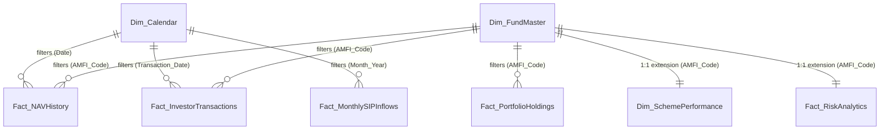

# Bluestock Mutual Fund Capstone
## Day 06: Power BI Dashboard Design Specification & Implementation Blueprint

---

## 1. Executive Summary & Project Context

This specification serves as the comprehensive implementation blueprint for the **Bluestock Mutual Fund Analytics Power BI Dashboard**. Designed to synthesize analytical insights produced across Days 1–5 of the Capstone project, this blueprint outlines the complete semantic data model, DAX calculation engine, page-by-page visual layout, interactive UX behaviors, and performance optimization guidelines required to build an enterprise-grade reporting solution.

### Primary Objectives
- **Executive Visibility**: Deliver high-level executive KPIs on total AUM, scheme count, overall investor participation, and SIP inflows.
- **Risk-Adjusted Performance Evaluation**: Track fund returns, benchmark comparison, Sharpe/Sortino ratios, Alpha, Beta, and maximum drawdowns across fund houses and asset categories.
- **Advanced Tail-Risk Monitoring**: Visualize 95% Historical Value at Risk (VaR), Conditional Value at Risk (CVaR / Expected Shortfall), and 90-day rolling Sharpe stability.
- **Investor Cohort & SIP Retention Analytics**: Monitor investor acquisition cohorts, lifetime value (LTV), SIP payment gaps, and at-risk investor churn indicators.

---

## 2. Data Integration & Source Inventory

The Power BI solution ingests 11 cleaned, pre-processed datasets generated from Days 1–5 stored in `Day-05-Advanced-Risk-Analytics/data/processed/` and `outputs/`.

| Dataset Name | Ingested Table Name | Type | Key Columns Ingested | Primary/Foreign Keys |
| :--- | :--- | :--- | :--- | :--- |
| `01_fund_master_cleaned.csv` | `Dim_FundMaster` | Dimension | `amfi_code`, `scheme_name`, `category`, `sub_category`, `fund_house`, `launch_date`, `risk_level` | `amfi_code` (PK) |
| `02_nav_history_cleaned.csv` | `Fact_NAVHistory` | Fact | `date`, `amfi_code`, `nav`, `daily_return` | `date` (FK), `amfi_code` (FK) |
| `03_aum_by_fund_house_cleaned.csv` | `Fact_AUMByFundHouse` | Fact / Dim | `date`, `fund_house`, `aum_lakh_crore`, `aum_crore`, `num_schemes` | `date` (FK), `fund_house` (FK) |
| `04_monthly_sip_inflows_cleaned.csv` | `Fact_MonthlySIPInflows` | Fact | `month_year`, `sip_inflow_crore`, `active_sip_accounts` | `month_year` (FK) |
| `05_category_inflows_cleaned.csv` | `Fact_CategoryInflows` | Fact | `month_year`, `category`, `net_inflow_crore` | `month_year` (FK), `category` (FK) |
| `06_industry_folio_count_cleaned.csv` | `Fact_IndustryFolioCount` | Fact | `month_year`, `category`, `total_folios` | `month_year` (FK), `category` (FK) |
| `07_scheme_performance_cleaned.csv` | `Dim_SchemePerformance` | Dimension | `amfi_code`, `return_1yr_pct`, `return_3yr_pct`, `return_5yr_pct`, `alpha`, `beta`, `sharpe_ratio`, `sortino_ratio`, `std_dev_ann_pct`, `max_drawdown_pct`, `expense_ratio_pct`, `aum_crore` | `amfi_code` (PK) |
| `08_investor_transactions_cleaned.csv` | `Fact_InvestorTransactions` | Fact | `investor_id`, `transaction_date`, `amfi_code`, `transaction_type`, `amount_inr`, `state`, `city`, `city_tier`, `age_group`, `gender`, `annual_income_lakh` | `transaction_date` (FK), `amfi_code` (FK), `investor_id` (FK) |
| `09_portfolio_holdings_cleaned.csv` | `Fact_PortfolioHoldings` | Fact | `amfi_code`, `company_name`, `sector`, `holding_pct`, `market_value_crore` | `amfi_code` (FK) |
| `10_benchmark_indices_cleaned.csv` | `Fact_BenchmarkIndices` | Fact | `date`, `index_name`, `closing_price`, `daily_return` | `date` (FK), `index_name` (FK) |
| `var_cvar_report.csv` | `Fact_RiskAnalytics` | Fact / Dim | `amfi_code`, `var_95`, `cvar_95`, `sharpe_ratio`, `sortino_ratio`, `risk_grade`, `var_rank` | `amfi_code` (FK) |
| *DAX Calculated Table* | `Dim_Calendar` | Dimension | `Date`, `Year`, `Quarter`, `Month`, `MonthName`, `MonthYear`, `DayOfWeek` | `Date` (PK) |

---

## 3. Data Model & Star Schema Architecture

### Architecture Overview
The data model follows a **Star Schema** architecture optimized for Power BI's VertiPaq columnar engine. `Dim_FundMaster`, `Dim_SchemePerformance`, and `Dim_Calendar` serve as central dimension tables filtering fact tables via one-to-many ($1:N$) single-direction relationships.



### Relationship Matrix & Filter Propagation

| From Table (Dimension) | From Column | To Table (Fact) | To Column | Cardinality | Cross Filter Direction | Status |
| :--- | :--- | :--- | :--- | :--- | :--- | :--- |
| `Dim_Calendar` | `Date` | `Fact_NAVHistory` | `date` | $1 : N$ | Single (Dim $\rightarrow$ Fact) | Active |
| `Dim_Calendar` | `Date` | `Fact_InvestorTransactions` | `transaction_date` | $1 : N$ | Single (Dim $\rightarrow$ Fact) | Active |
| `Dim_Calendar` | `Date` | `Fact_MonthlySIPInflows` | `month_year` | $1 : N$ | Single (Dim $\rightarrow$ Fact) | Inactive |
| `Dim_FundMaster` | `amfi_code` | `Fact_NAVHistory` | `amfi_code` | $1 : N$ | Single (Dim $\rightarrow$ Fact) | Active |
| `Dim_FundMaster` | `amfi_code` | `Fact_InvestorTransactions` | `amfi_code` | $1 : N$ | Single (Dim $\rightarrow$ Fact) | Active |
| `Dim_FundMaster` | `amfi_code` | `Fact_PortfolioHoldings` | `amfi_code` | $1 : N$ | Single (Dim $\rightarrow$ Fact) | Active |
| `Dim_FundMaster` | `amfi_code` | `Dim_SchemePerformance` | `amfi_code` | $1 : 1$ | Both | Active |
| `Dim_FundMaster` | `amfi_code` | `Fact_RiskAnalytics` | `amfi_code` | $1 : 1$ | Both | Active |

---

## 4. Comprehensive DAX Measures Dictionary

All measures are organized into a dedicated empty table named `_Measures` for clean model governance.

### Core Executive & AUM Measures

```dax
// 1. Total AUM (in Crores)
Total AUM = 
SUM(Dim_SchemePerformance[aum_crore])

// 2. Total Schemes Count
Total Schemes = 
DISTINCTCOUNT(Dim_FundMaster[amfi_code])

// 3. Total Unique Investors Count
Total Investors = 
DISTINCTCOUNT(Fact_InvestorTransactions[investor_id])

// 4. Total Investment Amount (INR)
Total Investment Amount = 
SUM(Fact_InvestorTransactions[amount_inr])

// 5. Total SIP Volume (INR)
Total SIP Amount = 
CALCULATE(
    SUM(Fact_InvestorTransactions[amount_inr]),
    KEEPFILTERS(Fact_InvestorTransactions[transaction_type] = "SIP")
)

// 6. Average NAV
Average NAV = 
AVERAGE(Fact_NAVHistory[nav])
```

### Risk & Risk-Adjusted Performance Measures

```dax
// 7. Average 3Y Annualized CAGR (%)
CAGR 3Y = 
AVERAGE(Dim_SchemePerformance[return_3yr_pct])

// 8. Weighted Sharpe Ratio
Sharpe Ratio = 
AVERAGE(Fact_RiskAnalytics[sharpe_ratio])

// 9. Weighted Sortino Ratio
Sortino Ratio = 
AVERAGE(Fact_RiskAnalytics[sortino_ratio])

// 10. Alpha (%)
Alpha = 
AVERAGE(Dim_SchemePerformance[alpha])

// 11. Beta
Beta = 
AVERAGE(Dim_SchemePerformance[beta])

// 12. Maximum Drawdown (%)
Max Drawdown = 
MIN(Dim_SchemePerformance[max_drawdown_pct])

// 13. Historical Value at Risk (95% Daily VaR)
VaR 95% = 
AVERAGE(Fact_RiskAnalytics[var_95])

// 14. Conditional Value at Risk (95% Daily CVaR)
CVaR 95% = 
AVERAGE(Fact_RiskAnalytics[cvar_95])

// 15. Average Expense Ratio (%)
Expense Ratio = 
AVERAGE(Dim_SchemePerformance[expense_ratio_pct])

// 16. Annualized Tracking Error (%)
Tracking Error = 
VAR ActiveReturns = Fact_NAVHistory[daily_return] - RELATED(Fact_BenchmarkIndices[daily_return])
RETURN
STDEV.S(ActiveReturns) * SQRT(252)
```

### Investor Behavior & Advanced Risk Measures

```dax
// 17. At-Risk Investor Count (SIP Gap > 35 Days)
At Risk Investors = 
VAR Threshold = 35
VAR LastDatasetDate = MAX(Fact_InvestorTransactions[transaction_date])
VAR AtRiskTable = 
    FILTER(
        VALUES(Fact_InvestorTransactions[investor_id]),
        VAR MaxGap = 
            MAXX(
                CALCULATETABLE(Fact_InvestorTransactions),
                VAR NextDate = 
                    CALCULATE(
                        MIN(Fact_InvestorTransactions[transaction_date]),
                        ALLEXCEPT(Fact_InvestorTransactions, Fact_InvestorTransactions[investor_id]),
                        Fact_InvestorTransactions[transaction_date] > EARLIER(Fact_InvestorTransactions[transaction_date])
                    )
                RETURN DATEDIFF(Fact_InvestorTransactions[transaction_date], NextDate, DAY)
            )
        VAR LastSIP = CALCULATE(MAX(Fact_InvestorTransactions[transaction_date]))
        VAR DaysSinceLast = DATEDIFF(LastSIP, LastDatasetDate, DAY)
        RETURN MaxGap > Threshold || DaysSinceLast > Threshold
    )
RETURN
COUNTROWS(AtRiskTable)

// 18. At-Risk Investor Rate (%)
At Risk Investor Rate = 
DIVIDE([At Risk Investors], [Total Investors], 0)

// 19. Herfindahl-Hirschman Index (HHI Market Concentration)
HHI Concentration Score = 
VAR TotalMarketAUM = CALCULATE(SUM(Fact_AUMByFundHouse[aum_crore]), ALL(Fact_AUMByFundHouse[fund_house]))
VAR AMCShares = 
    ADDCOLUMNS(
        VALUES(Fact_AUMByFundHouse[fund_house]),
        "ShareSq", POWER(DIVIDE(CALCULATE(SUM(Fact_AUMByFundHouse[aum_crore])), TotalMarketAUM, 0), 2)
    )
RETURN
SUMX(AMCShares, [ShareSq])

// 20. Average Investment Per Investor
Average Investment Per Investor = 
DIVIDE([Total Investment Amount], [Total Investors], 0)
```

---

## 5. Page 1 Specification: Executive Overview & AUM Analytics

### Purpose & Target Audience
Executive dashboard tailored for C-suite leaders and Fund Operations Directors to monitor top-level AUM distribution, market share across AMCs, overall SIP inflow trends, and macro investor participation.

### Visual Inventory & Canvas Layout

```text
+-----------------------------------------------------------------------------------------------+
| SLICERS: [ Year / Date Range ]  [ Fund House Multi-Select ]  [ Category (Equity/Debt/Hybrid) ]|
+-------------------+-------------------+-------------------+-------------------+---------------+
| CARD: Total AUM   | CARD: Total       | CARD: Total       | CARD: Total SIP   | CARD: Avg     |
| ₹5.42 Lakh Cr     | Schemes: 40       | Investors: 4,762  | Inflow: ₹1,850 Cr | Expense: 1.4% |
+-------------------+-------------------+-------------------+-------------------+---------------+
| VISUAL 1: Line & Clustered Column Chart                   | VISUAL 2: Donut Chart             |
| Monthly SIP Inflows vs Active SIP Accounts Trend           | AUM Share by Asset Category       |
+-----------------------------------------------------------+-----------------------------------+
| VISUAL 3: Treemap                                         | VISUAL 4: Top 10 AMCs Matrix      |
| AUM Breakdown by AMC & Asset Category                     | AMC AUM, Folios, Schemes Summary |
+-----------------------------------------------------------+-----------------------------------+
```

### Technical Visual Mapping Table

| Visual ID | Visual Type | Dataset | Axis / Categories | Values / Metrics | Slicers & Filters | Tooltips / Interactions |
| :--- | :--- | :--- | :--- | :--- | :--- | :--- |
| **P1-V1** | Card Group | `Dim_SchemePerformance`, `Fact_InvestorTransactions` | N/A | `[Total AUM]`, `[Total Schemes]`, `[Total Investors]`, `[Total SIP Amount]`, `[Expense Ratio]` | Global Date & Category Slicers | Tooltip: Prior period comparison |
| **P1-V2** | Line & Clustered Column | `Fact_MonthlySIPInflows`, `Dim_Calendar` | `Dim_Calendar[MonthYear]` | Column: `[Total SIP Amount]`<br>Line: `[Total Investors]` | Year Slicer | Hover details; Cross-filters P1-V3 & P1-V4 |
| **P1-V3** | Donut Chart | `Dim_FundMaster`, `Dim_SchemePerformance` | `Dim_FundMaster[category]` | `[Total AUM]` | All global slicers | Percentage share tooltip; Cross-filters matrix |
| **P1-V4** | Treemap | `Dim_FundMaster`, `Dim_SchemePerformance` | Group: `fund_house`<br>Details: `category` | `[Total AUM]` | Top 15 AMC filter | Direct selection filters entire page |
| **P1-V5** | Matrix Table | `Fact_AUMByFundHouse` | Rows: `fund_house` | `[Total AUM]`, `[Total Schemes]`, `[HHI Concentration Score]` | Sorted by `[Total AUM]` desc | Drillthrough to Page 2 (Scheme Performance) |

---

## 6. Page 2 Specification: Fund Performance & Risk-Adjusted Returns

### Purpose & Target Audience
Analytical workspace for Portfolio Managers and Product Research teams to conduct deep-dive return comparisons, evaluate benchmark alpha/beta generation, and inspect Sharpe/Sortino risk-adjusted performance.

### Visual Inventory & Canvas Layout

```text
+-----------------------------------------------------------------------------------------------+
| SLICERS: [ Fund House ]  [ Category ]  [ Morningstar Rating ]  [ Minimum AUM Slider ]         |
+-----------------------------------------------------------+-----------------------------------+
| VISUAL 1: Scatter Plot                                    | VISUAL 2: Clustered Bar Chart     |
| Risk (Annualized Volatility) vs Return (3Y CAGR)          | Top 10 Schemes by Alpha Generation|
+-----------------------------------------------------------+-----------------------------------+
| VISUAL 3: Matrix Table                                                                        |
| Complete Scheme Performance Scorecard (Rank, Sharpe, Sortino, Alpha, Beta, Max Drawdown)       |
+-----------------------------------------------------------------------------------------------+
```

### Technical Visual Mapping Table

| Visual ID | Visual Type | Dataset | Axis / Categories | Values / Metrics | Slicers & Filters | Tooltips / Interactions |
| :--- | :--- | :--- | :--- | :--- | :--- | :--- |
| **P2-V1** | Scatter Plot | `Dim_SchemePerformance`, `Dim_FundMaster` | X-Axis: `std_dev_ann_pct`<br>Y-Axis: `return_3yr_pct`<br>Size: `aum_crore`<br>Legend: `category` | X: Std Dev<br>Y: 3Y Return<br>Details: `scheme_name` | Category & AMC Slicers | Custom Tooltip Page showing Sharpe, Beta & Max Drawdown |
| **P2-V2** | Clustered Bar Chart | `Dim_SchemePerformance` | Y-Axis: `scheme_name` | X-Axis: `[Alpha]` | Top 10 Filter by Alpha | Color-coded (Green for Alpha > 0, Red for Alpha < 0) |
| **P2-V3** | Matrix Scorecard | `Dim_SchemePerformance`, `Fact_RiskAnalytics` | Rows: `category`, `scheme_name` | `[CAGR 3Y]`, `[Sharpe Ratio]`, `[Sortino Ratio]`, `[Alpha]`, `[Beta]`, `[Max Drawdown]`, `[Expense Ratio]` | Conditional formatting on Sharpe & Sortino | Direct drillthrough to Page 3 (Tail Risk) |

---

## 7. Page 3 Specification: Advanced Risk Analytics & Tail-Risk (VaR / CVaR)

### Purpose & Target Audience
Quantitative risk management dashboard for Chief Risk Officers (CRO) and Risk Analysts to track extreme downside vulnerability, 95% Historical Value at Risk (VaR), Expected Shortfall (CVaR), and 90-day rolling Sharpe stability.

### Visual Inventory & Canvas Layout

```text
+-----------------------------------------------------------------------------------------------+
| SLICERS: [ Scheme Selector Dropdown ]  [ Risk Grade: High / Moderate / Low ]                  |
+-----------------------------------------------------------+-----------------------------------+
| VISUAL 1: Line Chart                                      | VISUAL 2: Bar Chart               |
| 90-Day Rolling Sharpe Ratio vs Baseline (1.0)             | Top 10 Schemes by Worst 95% CVaR  |
+-----------------------------------------------------------+-----------------------------------+
| VISUAL 3: Clustered Column Chart                          | VISUAL 4: Risk Grid Matrix        |
| 95% Historical VaR vs 95% CVaR Comparison per Category    | Scheme VaR Rank & Tail Loss Table |
+-----------------------------------------------------------+-----------------------------------+
```

### Technical Visual Mapping Table

| Visual ID | Visual Type | Dataset | Axis / Categories | Values / Metrics | Slicers & Filters | Tooltips / Interactions |
| :--- | :--- | :--- | :--- | :--- | :--- | :--- |
| **P3-V1** | Line Chart | `Fact_NAVHistory`, `Dim_Calendar` | X-Axis: `Date` | Y-Axis: `[Rolling Sharpe Ratio]` | Single Scheme Selector | Reference lines at 0.0 (Baseline) and 1.0 (Target) |
| **P3-V2** | Horizontal Bar Chart | `Fact_RiskAnalytics`, `Dim_FundMaster` | Y-Axis: `scheme_name` | X-Axis: `[CVaR 95%]` | Top 10 Worst Tail Risk | Highlights tail loss magnitude |
| **P3-V3** | Clustered Column Chart | `Fact_RiskAnalytics`, `Dim_FundMaster` | X-Axis: `category` | Y-Axis 1: `[VaR 95%]`<br>Y-Axis 2: `[CVaR 95%]` | Category Filter | Shows average tail loss gap per category |
| **P3-V4** | Matrix Risk Grid | `Fact_RiskAnalytics` | Rows: `risk_grade`, `scheme_name` | `var_rank`, `[VaR 95%]`, `[CVaR 95%]`, `[Sharpe Ratio]`, `[Sortino Ratio]` | Risk Grade Filter | Conditional heatmap highlighting severe VaR |

---

## 8. Page 4 Specification: Investor Behavior, Cohort LTV & SIP Continuity

### Purpose & Target Audience
Growth Marketing and Investor Retention dashboard for Customer Success and Investor Relations leads to analyze onboarding cohorts, track SIP payment gaps, and target at-risk investors.

### Visual Inventory & Canvas Layout

```text
+-----------------------------------------------------------------------------------------------+
| SLICERS: [ Onboarding Cohort Year ]  [ City Tier (T30 / B30) ]  [ At-Risk Status Toggle ]    |
+-------------------+-------------------+-------------------+-----------------------------------+
| CARD: Total       | CARD: Active      | CARD: At-Risk     | CARD: At-Risk Rate                |
| Investors: 4,762  | SIPs: 856         | Investors: 3,906  | 82.0%                             |
+-------------------+-------------------+-------------------+-----------------------------------+
| VISUAL 1: Stacked Bar Chart                               | VISUAL 2: Histogram / Bar Chart   |
| Cohort LTV & Total Investment by Onboarding Year          | Distribution of SIP Gap Days      |
+-----------------------------------------------------------+-----------------------------------+
| VISUAL 3: At-Risk Investor Detail Table                                                       |
| Investor ID, City, Last SIP Date, Max Gap Days, At-Risk Flag, Recommended Action              |
+-----------------------------------------------------------------------------------------------+
```

### Technical Visual Mapping Table

| Visual ID | Visual Type | Dataset | Axis / Categories | Values / Metrics | Slicers & Filters | Tooltips / Interactions |
| :--- | :--- | :--- | :--- | :--- | :--- | :--- |
| **P4-V1** | Card Group | `Fact_InvestorTransactions` | N/A | `[Total Investors]`, `[Active Investors]`, `[At Risk Investors]`, `[At Risk Investor Rate]` | Cohort & City Tier Slicers | Immediate alert styling for At-Risk Rate |
| **P4-V2** | Stacked Column Chart | `Fact_InvestorTransactions` | X-Axis: `cohort_year`<br>Legend: `transaction_type` | Y-Axis: `[Total Investment Amount]` | Cohort Slicer | Tooltip displays avg investment per investor |
| **P4-V3** | Clustered Column | `Fact_InvestorTransactions` | X-Axis: `gap_days_bin` | Y-Axis: `[Total Investors]` | Threshold filter (> 35 days) | Red highlight for bins > 35 days |
| **P4-V4** | Detail Table | `Fact_InvestorTransactions` | Columns: `investor_id`, `city`, `city_tier`, `last_sip_date`, `max_gap_days` | `[At Risk Flag]` | Filter: `is_at_risk = TRUE` | Actionable export for SMS/WhatsApp reminder campaigns |

---

## 9. Design System, Theme Palette & UX Guidelines

### Canvas & Grid Alignment
- **Canvas Ratio**: 16:9 Widescreen ($1920 \times 1080 \text{ px}$ resolution).
- **Grid Layout**: 12-column responsive layout grid with $16\text{ px}$ outer padding and $12\text{ px}$ visual spacing.
- **Visual Hierarchy**: Top band reserved for global slicers and metric summary cards; left-to-right reading flow for main charts.

### Color Palette Specification

```text
Primary Accent (Navy):      #1E3A8A (Headers, Primary Bars)
Secondary Accent (Slate):   #0F172A (Text, Dark Panels)
Background Tone (Off-White): #F8FAFC (Canvas Background)
Card Background:            #FFFFFF (Clean Visual Containers)
Positive / Success (Green): #10B981 (Alpha > 0, Active SIPs)
Warning / Caution (Gold):   #F59E0B (Moderate Risk, Moderate Sharpe)
Negative / Risk (Red):      #EF4444 (High VaR, At-Risk Investors)
Neutral Gray:               #64748B (Subtitles, Borders, Gridlines)
```

### Typography Hierarchy

| UI Element | Font Family | Size (pt) | Weight | Color |
| :--- | :--- | :--- | :--- | :--- |
| **Page Title** | Segoe UI Semibold | 22 pt | Bold | `#0F172A` |
| **Section Header** | Segoe UI Semibold | 16 pt | Semi-Bold | `#1E3A8A` |
| **Card Metric Value** | Segoe UI Bold | 30 pt | Bold | `#1E3A8A` |
| **Card Subtitle** | Segoe UI | 10 pt | Regular | `#64748B` |
| **Axis Titles / Labels** | Segoe UI | 10 pt | Regular | `#475569` |
| **Table Header / Body** | Segoe UI | 10 pt / 9.5 pt | Bold / Regular | `#0F172A` |

---

## 10. Power BI Performance Optimization & Governance Blueprint

### VertiPaq Engine Optimization
1. **Remove Unused Columns**: Exclude raw strings (e.g., raw transaction IDs or redundant descriptions) not required in visuals.
2. **Column Cardinality Optimization**: Split timestamps into separate `Date` and `Time` columns. Pre-calculate date groupings in `Dim_Calendar`.
3. **Integer Surrogate Keys**: Use integer surrogate keys for join relationships instead of string-based IDs.
4. **Disable Auto Date/Time**: Disable Power BI's automatic hidden date tables (`File -> Options -> Data Load -> Auto Date/Time = OFF`) to reduce memory footprint by up to 40%.

### DAX Best Practices
- Use `DIVIDE(Numerator, Denominator, AlternateResult)` instead of raw `/` division operators.
- Prefer `KEEPFILTERS()` over full `FILTER(ALL(...))` tables to preserve engine filter context.
- Store measure logic in variables (`VAR ... RETURN ...`) to evaluate expressions once instead of repeating calculations inside iteration functions (`SUMX`, `AVERAGEX`).

### Model Validation Checklist

- [x] All 11 pre-processed datasets mapped into Star Schema.
- [x] Dedicated `_Measures` table housing all 20 DAX formulas.
- [x] Single-direction 1-to-many relationship filter propagation.
- [x] Explicit DAX Date Table (`Dim_Calendar`) established.
- [x] 4 distinct, target-driven dashboard pages fully specified.
