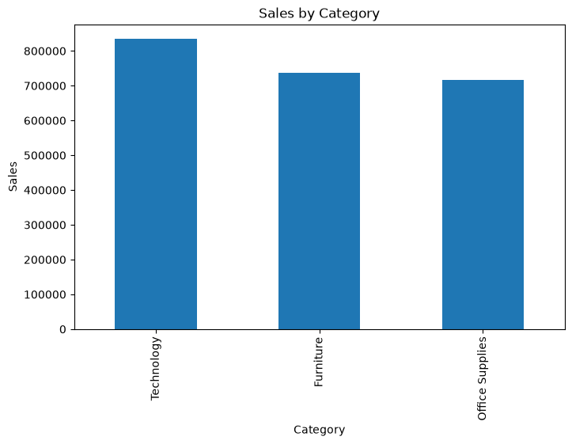
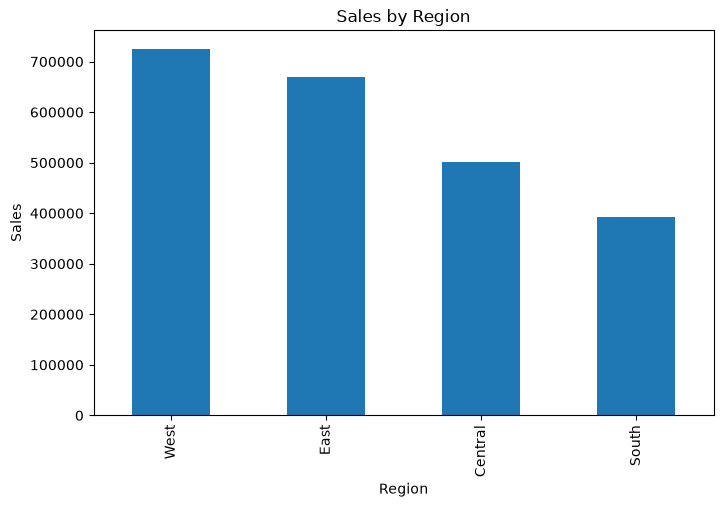
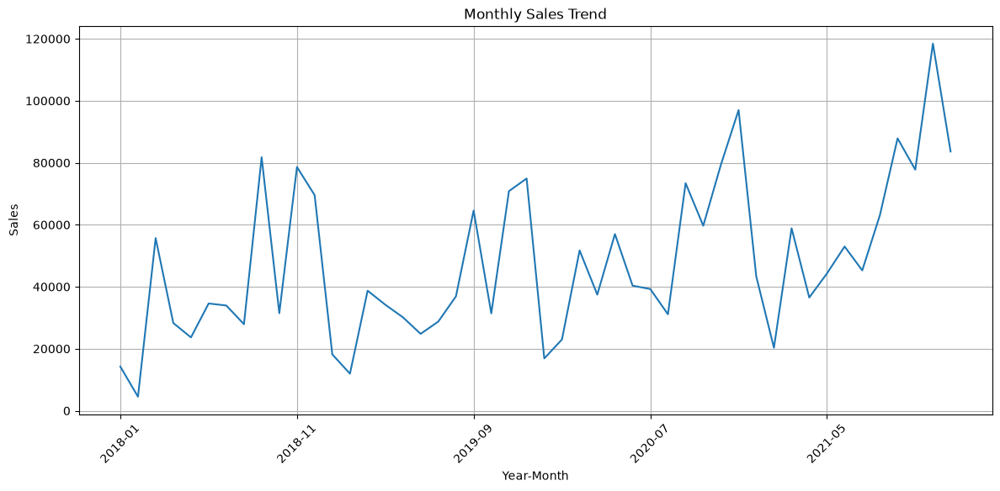
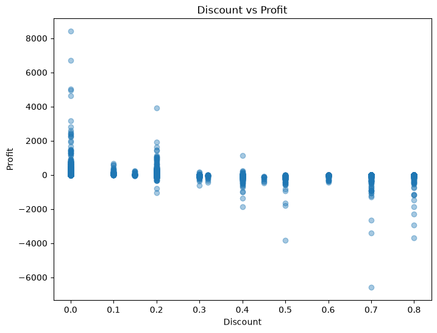

# Exploratory Data Analysis (EDA) Report
**Project:** Retail Sales Analysis using the Sample Superstore Dataset  
**Prepared by:** Shubham Sharma  
**Tools Used:** Python, Pandas, NumPy, Matplotlib  

---

## Introduction
This report provides an executive summary of the Exploratory Data Analysis (EDA) performed on the Sample Superstore dataset. The analysis evaluates overall sales performance, profitability across product categories and regions, customer segment contributions, and the financial impact of promotional discounting.

---

## Dataset Overview
The Sample Superstore dataset contains transactional records for a fictional US retail company, including information on orders, customers, products, sales, profit, discounts, and shipping. The data spans four years, from January 2018 through December 2021.

| Metric | Value |
| :--- | :--- |
| **Dataset** | Tableau Sample Superstore |
| **Time Period** | Jan 3, 2018 – Dec 30, 2021 |
| **Raw Records** | 9,994 |
| **Cleaned Records** | 9,983 |
| **Features** | 21 columns |
| **Unique Orders** | 5,003 |
| **Unique Customers** | 793 |

---

## Data Cleaning
Data preparation was completed in Python to ensure dataset accuracy and consistency:
- **Data Types & Dates**: Converted `Order Date` and `Ship Date` from strings to datetime objects.
- **Missing Values**: Identified 11 missing `Postal Code` values (all in Burlington, Vermont) and removed them, resulting in 9,983 valid records.
- **Duplicates**: Confirmed 0 duplicate rows across the dataset.
- **Outliers**: Analyzed right-skewed distributions in Sales and Profit using box plots. Outliers represent legitimate high-value orders and discount losses, so they were retained.
- **Export**: Saved the cleaned dataset to `../../data/cleaned/superstore_cleaned.csv`.

---

## Key Performance Indicators (KPIs)
Top-level metrics calculated from the 4-year dataset are summarized below:

| Metric | Value |
| :--- | :--- |
| **Total Sales** | $2,288,271.49 |
| **Total Profit** | $284,152.04 |
| **Total Orders** | 5,003 |
| **Total Customers** | 793 |

---

## EDA Findings

### Category Performance
Technology generated the highest total sales and profit among all categories. Office Supplies maintained steady profitability across high transaction volumes, whereas Furniture produced strong sales volume but significantly lower profit due to heavy discounting on tables and bookcases.

### Regional Performance
The West region led nationwide performance in both sales and profit, followed by the East region. The Central region recorded lower profitability relative to its sales volume, while the South region maintained steady profits despite lower overall volume.

### Customer Segment & Monthly Trends
The Consumer segment was the primary revenue driver, contributing over half of total sales and profit, followed by Corporate and Home Office segments. Monthly sales showed a consistent year-over-year upward growth trend from 2018 to 2021, with recurring seasonal surges in November and December.

### Correlation & Discount Impact
Sales and Profit exhibit a moderate positive correlation (+0.48), while Discount and Profit show a weak negative correlation (-0.22). These relationships indicate statistical association rather than causation. Higher discounts are strongly associated with reduced profitability: discounts up to 15% maintain positive margins, whereas discounts of 20% or higher result in severe profit erosion and frequent losses.

---

## Key Business Insights
- **Technology Category Drives Profitability**: Technology is the top-performing category in both sales and profit, led by copiers, phones, and accessories.
- **Furniture Category Suffers Low Margins**: Furniture generates high sales volume but minimal profit due to aggressive discounting on tables and bookcases.
- **West Region Leads Nationally**: The West region leads all geographic territories in sales and profit, while the Central region experiences squeezed margins.
- **Consumer Segment is the Primary Revenue Driver**: Consumer customers account for over 50% of total revenue and profit.
- **Strong Q4 Seasonality**: Sales show steady 4-year growth with recurring peak demand in November and December.
- **Aggressive Discounting Destroys Profit**: Discounts of 20% or higher consistently lead to negative profit, with extreme discounts (40%–80%) causing severe financial losses.
- **Revenue Concentration in Flagship Products**: High-ticket items, led by the Canon imageCLASS 2200 Copier, contribute significantly to top-line sales.

---

## Conclusion
The data cleaning and exploratory analysis were successfully completed, establishing core business KPIs and identifying key drivers of revenue and profitability. The resulting cleaned dataset and analytical findings provide a solid foundation for the remaining project deliverables, including SQL analysis, Excel dashboards, and Power BI visualizations.
